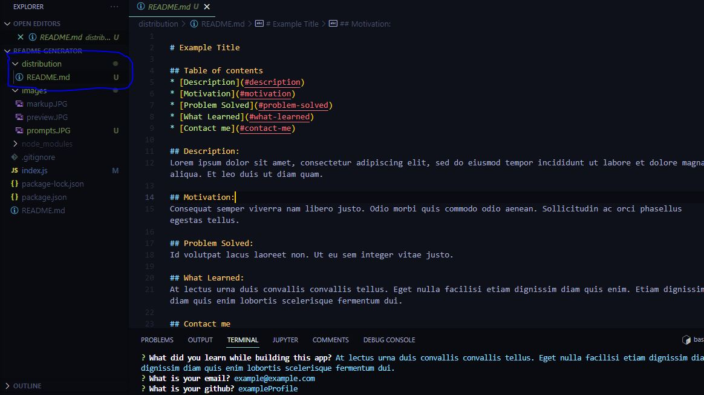

# README Generator

## Table of contents
* [General info](#general-info)
* [Technologies](#technologies)
* [App](#app)
* [Contact me](#contact-me)

## General info
This is a node.js README generator.  

## Technologies
Project is created with:
* JavaScript
* Node.js

## App
* Answer the prompts. 

* README.md file will be generated with your answers.  

* Preview

## Contributions
* I used a similar project as a template for this project. 
* Thank you for your debugging help Keshia! 

## Contact me

* [Email: mel.chavez.code@gmail.com](mailto:mel.chavez.code@gmail.com) 
* [GitHub: 12MChavez](https://github.com/12MChavez)